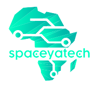

<h1 style="margin-top: 1em; text-align: center; margin-bottom: 3em;">
  <p><a href="https://spaceyatech.com/"></a></p>
  <p>  Welcome to SpaceYaTech Website Redesign!</p>
</h1>

<hr>

Welcome to the SpaceYaTech website redesign project! This Readme provides comprehensive information about the project, including project description, project structure, communication channels, roadmap, license information, acknowledgments, and links to other important files.
<hr>

## Project Description

The SpaceYaTech website is being redesigned to enhance its user experience and visual appeal. The new website will be built using React with the Vite library and Tailwind CSS framework. Designers are collaborating through Figma to create the new design, while developers are using GitHub for contribution and monitoring the workflow.

Figma Design Reference: [Figma Design](https://www.figma.com/file/QZwtseXogSFjLNz64uLwjV/SYT-Website-Redesign-Complete?type=design&node-id=1113%3A7655&t=xSmmgQWxa0Z31bfo-1)

## Project Structure

The project follows a standard directory structure:

```
.
├── public
├── src
│   ├── APP
│   │   ├── components 
│   ├── assets
│   │   ├── images
│   ├── router
│   └── ...
├── ...
├── docs
│   ├── CONTRIBUTING.md
│   ├── CODE_OF_CONDUCT.md
├── README.md
└── ...
```

- The `public` directory contains static assets like images, icons, etc.
- The `src` directory contains the main source code of the project, including components, pages, styles, and other related files.

## Communication Channels

For effective collaboration and communication, we recommend the following channels:

- **[Discord Sever](https://discord.gg/pnDtnJScPu)**: Join the SpaceYaTech community on Discord. 

- **[Rocket.Chat](https://www.rocket.chat/install#Apps)**: Join the SpaceYaTech on Rocket.Chat platform. Share your Rocket.Chat username with the project maintainers to get an invitation. 

- **[GitHub Discussions](https://github.com/SpaceyaTech/SYT-Web-Redesign/discussions)**: Use GitHub Discussions for general discussions, feature requests, and questions related to the project.

- **[GitHub Issues](https://github.com/SpaceyaTech/SYT-Web-Redesign/issues)**: Use GitHub Issues to report bugs, track feature requests, and discuss specific issues related to the project.

## Roadmap

The following roadmap outlines the planned milestones and features for the website redesign project:

1. Design planning and collaboration
2. Initial implementation of core pages
3. Integration of design assets
4. Styling and responsiveness
5. Content population and review
6. Performance optimization and testing
7. Final bug fixes and refinements

Please refer to the [Roadmap](https://github.com/SpaceyaTech/SYT-Web-Redesign/wiki/SYT-Project-RoadMap) page for more details.

## License Information

The SpaceYaTech website redesign project is licensed under the [Apache License](http://www.apache.org/licenses/). For more details, please refer to the [LICENSE](https://github.com/SpaceyaTech/SYT-Web-Redesign/blob/main/LICENSE) file.

## Acknowledgments

We would like to acknowledge the following individuals and resources for their contributions and support during the development of this project:

- 

## Contributing

Please see our [Contributing Guidelines](docs/CONTRIBUTING.md) for detailed information on how to contribute to the project.

## Code of Conduct


We follow the [](docs/CODE_OF_CONDUCT.md). Please review it to understand our community standards and expected behavior.

## Tech Stacks Used for Development:


[//]: # (https://github.com/Ileriayo/markdown-badges)

<strong>Thank you</strong> for your interest and contributions to the SpaceYaTech website redesign project. Together, we can create an outstanding website experience!